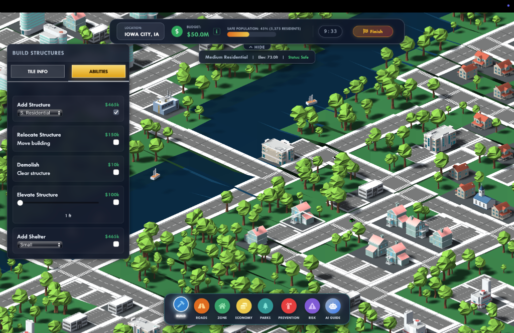
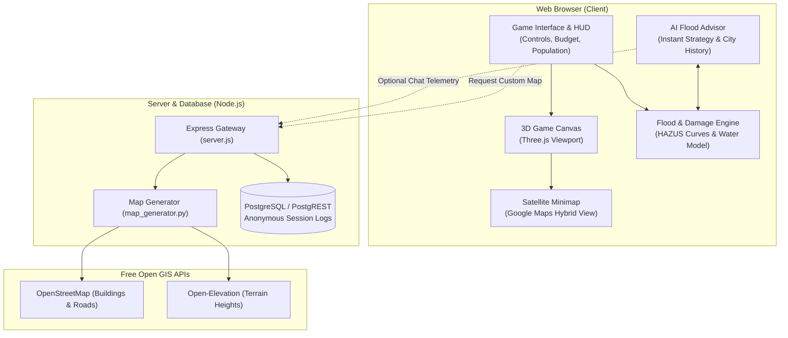

# FloodGame
### An Interactive 3D Simulation Game for Flood Mitigation & Disaster Education
Developed by the [Hydroinformatics Lab (IHI Lab) at Tulane University](https://hydroinformatics.tulane.edu/)

📄 **Read the Paper:** [FloodGame: An interactive 3D serious game on flood mitigation for disaster awareness and education (*Environmental Modelling & Software*, 2025)](https://doi.org/10.1016/j.envsoft.2025.106418)

<div align="center">
    
</div>

⭐ **If you find FloodGame helpful for research, teaching, or learning about flood resilience, please consider giving this repository a star! It helps others discover the project and supports our open-source work.**

---

## Table of Contents
* [About the Game](#about-the-game)
* [How to Play](#how-to-play)
* [How the System Works](#how-the-system-works)
  * [📦 Real-World Maps & Terrain (GIS)](#-real-world-maps--terrain-gis)
  * [⚙️ Flood & Damage Simulation](#️-flood--damage-simulation)
  * [🌐 3D Graphics & Satellite Minimap](#-3d-graphics--satellite-minimap)
  * [🏛️ AI Advisor & Classroom Logging](#️-ai-advisor--classroom-logging)
* [System Architecture](#system-architecture)
* [Mitigation Defenses & Costs](#mitigation-defenses--costs)
* [Building Types & Vulnerability](#building-types--vulnerability)
* [Real-World Historical Scenarios](#real-world-historical-scenarios)
* [Custom Location Sandbox (Any US City)](#custom-location-sandbox-any-us-city)
* [Quick Start & Setup](#quick-start--setup)
* [Backend Server & API](#backend-server--api)
* [Contributing](#contributing)
* [Acknowledgements](#acknowledgements)
* [Citation & References](#citation--references)

---

## About the Game

**FloodGame** is an educational, interactive 3D simulation game designed to teach students, community leaders, and emergency planners how flood defense and disaster management work in the real world.

As the emergency manager of a city, you are given a budget and a countdown timer before a major river or coastal flood crests. Your mission is to:
1. **Analyze the terrain**: Spot low-lying neighborhoods, rivers, and vital buildings (hospitals, water plants, fire stations, schools, and homes).
2. **Choose your defense strategy**: Spend your budget on concrete flood walls, temporary sandbags, raising buildings on stilts, wet/dry floodproofing, emergency shelters, or flood insurance.
3. **Get guidance from an AI Advisor**: Ask questions to a built-in AI tutor about what to prioritize, how to budget, or how different engineering solutions work.
4. **Survive the flood**: Watch the floodwaters rise in real-time 3D, see which barriers hold, and review an after-action report showing how many lives and buildings you saved.

The entire game runs directly in your web browser—no extra software or downloads required.

---

## How to Play

```
   1. Pick a City           2. Inspect Risk           3. Place Defenses          4. Run Simulation
 ┌─────────────────┐       ┌─────────────────┐       ┌─────────────────┐       ┌─────────────────┐
 │ Choose from 6   │  ──►  │ Hover on tiles, │  ──►  │ Click tiles to  │  ──►  │ Hit 'Start' or  │
 │ historical maps │       │ check elevation │       │ buy walls, bags,│       │ let timer run.  │
 │ or generate any │       │ & toggle Risk   │       │ elevate homes,  │       │ Watch flood &   │
 │ US city!        │       │ Overlay (grid). │       │ or buy policies.│       │ review report.  │
 └─────────────────┘       └─────────────────┘       └─────────────────┘       └─────────────────┘
```

1. **Launch the Game**: Open the link in any modern browser (Chrome, Firefox, Safari, or Edge).
2. **Select a Location**:
   * Choose one of the **6 built-in historical scenarios** (like Des Moines, IA or St. Bernard Parish, LA).
   * Or switch to the **Custom Location** tab and type in any US city or town (e.g. *Seattle, WA* or *Syracuse, NY*) to automatically generate a 3D map from real elevation and street data.
3. **Inspect the Map**:
   * Hover over any tile to see its ground height, structure type, and risk level.
   * Click the **Risk Overlay** button to color-code the map: red tiles are at high risk of flooding first, yellow is medium risk, and white is high ground.
4. **Deploy Defenses**: Click on any land or building tile to open the mitigation menu and spend your budget.
5. **Chat with the AI Advisor**: Click the AI Tutor button in the bottom right if you want tips on how to defend the city or budget wisely.
6. **Watch the Flood**: Click **Start** (or wait for the countdown timer to reach zero). The water will rise in 3D across the city.
7. **Check Your Score**: At the end, an After-Action Report shows how much money was saved, how many homes were protected, and what percentage of the population stayed safe.

---

## How the System Works

### 📦 Real-World Maps & Terrain (GIS)
FloodGame creates realistic 50×50 game maps using real geospatial data sources:

| Component | Source | What It Does |
| :--- | :--- | :--- |
| **Street & Building Data** | OpenStreetMap (Overpass API) | Downloads real building outlines, roads, and waterways for any selected area. |
| **Topography & Elevation** | Open-Elevation & USGS APIs | Pulls real elevation data to create the 3D ground heightmap. |
| **City Search & Geocoding** | Nominatim (OSM) | Turns city/town names into geographic coordinates and bounding boxes. |
| **Damage Curves** | FEMA HAZUS-MH standard | Uses real-world depth-damage curves to calculate repair costs based on water depth. |

### ⚙️ Flood & Damage Simulation
The simulation runs locally in the browser to calculate water flow and damages:

| Simulation Feature | How It Works |
| :--- | :--- |
| **Water Flow** | Water rises and spreads across low-lying tiles, naturally blocked by terrain and flood walls. |
| **Structural Damage** | Computes how much money each building loses based on how many feet of water reached it. |
| **Barrier Failure** | Sandbags can hold shallow water; permanent flood walls stop deep water up to their height limit. |
| **Population Safety** | Calculates how many residents were kept safe in protected buildings or evacuated to shelters. |
| **Financial Ledger** | Tracks remaining budget, money spent on defenses, post-flood repairs, and insurance payouts. |

### 🌐 3D Graphics & Satellite Minimap
Built with Three.js for interactive 3D rendering:

| Visual Feature | Description |
| :--- | :--- |
| **3D World View** | Smooth isometric 3D controls—rotate, pan, zoom, and click on any individual tile. |
| **Animated Water** | Realistic water mesh that rises, crests at peak flood stage, and gradually recedes. |
| **Live Satellite Minimap** | Real Google Maps satellite view showing an overview of the city and where your camera is pointing. |
| **Risk Heatmap** | One-click button to highlight flood-prone areas in red and yellow. |
| **Scoreboard & Report** | Clean breakdown modal summarizing your strategy's return on investment (ROI). |

### 🏛️ AI Advisor & Classroom Logging
Designed for both self-guided play and structured university/school classes:

| Feature | Description |
| :--- | :--- |
| **AI Flood Tutor** | In-game assistant that gives instant recommendations based on your current city and remaining budget. |
| **City Knowledge Base** | Contains real flood histories (1927, 1993, 2005, 2008, 2019) so the tutor gives authentic advice. |
| **Anonymous Chat Logs** | Optional backend endpoint that logs student questions and strategies for educational research. |

---

## System Architecture



---

## Mitigation Defenses & Costs

You can deploy both **structural** (physical barriers) and **non-structural** (policies and elevation) measures:

| Defense Measure | Type | In-Game Cost | How It Works | When to Use It |
| :--- | :--- | :--- | :--- | :--- |
| **Concrete Flood Wall** | Ground | $38k – $250k / tile (Levels 1–6) | Completely blocks water up to wall height. | Best along main riverbanks and around critical water/power plants. |
| **Sandbag Dikes** | Building | $33k – $99k / building (Levels 1–3) | Temporary barrier that blocks shallow water. | Great for fast, cheap perimeter defense around houses and schools. |
| **Elevate Structure** | Building | $30k – $54k / building (Levels 1–10) | Raises the building on pilings above flood level. | Best for residential homes in low-lying floodplains. |
| **Dry Floodproofing** | Building | $12k – $37k / building (Levels 1–3) | Seals outer walls with waterproof coating (1–4 ft). | Good for commercial storefronts and brick buildings. |
| **Wet Floodproofing** | Building | $6k – $21k / building (Levels 1–3) | Lets water safely enter crawlspaces to reduce wall pressure. | Best for garages, warehouses, and industrial sheds. |
| **Flood Insurance (NFIP)** | Policy | 0.5% – 1.0% value | Reimburses 80%+ of repair costs after the flood. | Best for buildings too expensive or difficult to protect with walls. |
| **Managed Relocation** | Policy | $81k / building | Moves a high-risk building to a safe high-elevation zone. | For repeatedly flooded homes directly in river paths. |
| **Evacuation Shelters** | Ground | $300k (100 people) / $500k (250) / $800k (500) | Provides a safe refuge for displaced citizens during the flood. | Place on high ground near dense residential neighborhoods. |
| **Absorbing Parks** | Ground | Low | Turns concrete ground into green space that absorbs runoff. | Good along waterfronts and empty lots. |

---

## Building Types & Vulnerability

The city contains 17 building classes. Some are standard homes and businesses, while others are **Critical Infrastructure** that impact the whole town:

| Building Code | Building Type | Category | Why It Matters |
| :--- | :--- | :--- | :--- |
| `Res1` / `Res2` / `Res3` | Small, Medium, Large Housing | General | Houses the town's population (5 to 40 people per building). Keep them safe to maintain a high population score. |
| `Com` / `Com2` | Commercial Retail & Offices | General | Major economic value ($800k–$1M). Flooding causes high commercial loss. |
| `Ind` | Industrial Factories | General | High property and equipment value ($1.8M–$2.1M). High risk of chemical or equipment damage. |
| `Hos` | Regional Hospital | **Critical** | Highest-value structure ($25M). Must stay dry for emergency medical access. |
| `Wat` | Water Works / Treatment Plant | **Critical** | If flooded, the entire city loses clean drinking water (as happened in Des Moines in 1993!). |
| `Fire` | Fire Station | **Critical** | Needed for disaster response and emergency evacuations. |
| `Pol` | Police Headquarters | **Critical** | Coordinates emergency management and road safety. |
| `School` | Public School | **Critical** | Serves as a community hub and potential shelter. |
| `Bank`, `Chu`, `Htl`, `Chse` | Banks, Churches, Hotels, Courthouse | Critical | Important community and financial assets ($1M value each). |
| `Shel1-3` | Emergency Evacuation Shelters | Shelter | Houses 100 to 500 evacuees safely through the flood. |

---

## Real-World Historical Scenarios

FloodGame comes with 6 historical US flood disaster scenarios:

* **St. Bernard Parish, Louisiana (Hurricane Katrina, 2005)**:
  A coastal parish next to New Orleans. In 2005, storm surge breached canal levees, submerging 98% of the parish under 8–12 feet of water. *Strategy: Build high flood walls along canals and protect evacuation shelters.*
* **Des Moines, Iowa (The Great Flood of 1993)**:
  Located where the Des Moines and Raccoon Rivers meet. In 1993, the municipal Water Works was submerged, leaving 250,000 people without clean tap water for 12 days. *Strategy: Defend the water treatment plant and downtown banks.*
* **Cedar Rapids, Iowa (Record 2008 Flood)**:
  A major manufacturing hub on the Cedar River. In 2008, the river crested 11 feet above any past record, flooding 1,300 city blocks. *Strategy: Build levees around food factories and water utilities.*
* **Iowa City, Iowa (2008 Midwest Floods)**:
  Bisected by the Iowa River. In 2008, the upstream Coralville Reservoir overflowed, causing $750M in damage to University labs, student housing, and medical centers. *Strategy: Protect hospitals, schools, and university housing.*
* **Davenport, Iowa (Record 2019 Flood)**:
  Has no permanent concrete sea wall, choosing instead to keep its riverfront open with parks and temporary barriers. In 2019, temporary barriers breached, flooding downtown for 51 straight days. *Strategy: Use temporary sandbags and floodproofing.*
* **Greenville, Mississippi (Great 1927 Flood)**:
  A historic Mississippi Delta town at the site of the famous 1927 levee breach that flooded 27,000 square miles. *Strategy: Protect river ports and grain storage facilities.*

---

## Custom Location Sandbox (Any US City)

You can generate a playable 3D map for **any city or town in the United States**:

### Option 1: In the Game UI
1. Click **Custom Location** on the start screen.
2. Type any town name (e.g., `New Orleans, LA`, `Dubuque, IA`, or `Austin, TX`).
3. Click **Generate Map**. The game will fetch real elevation and streets in ~15 seconds.

### Option 2: Using the Python CLI
```bash
# Generate by city name
python3 sources/maps/map_generator.py --location "Seattle, WA" --name seattle

# Generate by exact coordinates
python3 sources/maps/map_generator.py --lat 41.6611 --lon -91.5302 --name custom_map --rotation 15
```

---

## Quick Start & Setup

### Requirements
* [Node.js](https://nodejs.org/) (v16 or newer)
* [Python 3](https://www.python.org/) (optional, only needed if generating custom maps from scratch)
* A modern web browser (Chrome, Firefox, Safari, Edge)

### Running Locally in 3 Steps

1. **Clone the repository**:
   ```bash
   git clone https://github.com/uihilab/FloodGame.git
   cd FloodGame
   ```

2. **Install dependencies**:
   ```bash
   npm install
   ```

3. **Start the game**:
   ```bash
   npm start
   ```
   Open your browser and go to **`http://localhost:3005`**.

---

## Backend Server & API

FloodGame includes an Express gateway (`server.js`) for custom map generation and classroom chat logging:

| Method | Endpoint | Description |
| :--- | :--- | :--- |
| `GET` | `/health` | Server health check. |
| `POST` | `/generate-map` | Generates a 50×50 game map for a given city string (`{ "location": "City, State" }`). |
| `POST` | `/log` | Saves student/AI chat messages for educational research. |
| `GET` | `/get-logs` | Admin endpoint to view session chat logs. |

---

## Contributing

FloodGame is free and open-source. We welcome help from developers, teachers, and researchers:
* **Bug Reports & Ideas**: Open an issue on GitHub.
* **Code Contributions**: Submit a pull request with new features, visual improvements, or optimization fixes.
* **Teaching & Classroom Use**: If you are using FloodGame in a course or workshop, feel free to reach out to our lab team!

⭐ **Enjoying FloodGame? Please leave a star on GitHub — it helps more students and researchers find the tool!**

---

## Acknowledgements

FloodGame is developed and maintained by the **Hydroinformatics Lab (IHI Lab) at Tulane University**: [https://hydroinformatics.tulane.edu/](https://hydroinformatics.tulane.edu/)

This work is supported by the **National Science Foundation (NSF)** under the Pathways to Enable Open-Source Ecosystems (POSE) program.

---

## Citation & References

If you use FloodGame in your research, software, or teaching, please cite the official journal publication:

```bibtex
@article{demiray2025floodgame,
  title={FloodGame: An interactive 3D serious game on flood mitigation for disaster awareness and education},
  author={Demiray, B. Z. and Sermet, Y. and Yildirim, E. and Demir, I.},
  journal={Environmental Modelling \& Software},
  volume={188},
  pages={106418},
  year={2025},
  publisher={Elsevier},
  doi={10.1016/j.envsoft.2025.106418}
}
```

### Related Lab Publications
* **Demiray, B. Z., Sermet, Y., Yildirim, E., & Demir, I. (2025).** FloodGame: An interactive 3D serious game on flood mitigation for disaster awareness and education. *Environmental Modelling & Software*, 188, 106418. [https://doi.org/10.1016/j.envsoft.2025.106418](https://doi.org/10.1016/j.envsoft.2025.106418)
* **Ewing, G., Mantilla, R., Krajewski, W., & Demir, I. (2022).** Interactive hydrological modelling and simulation on client-side web systems: An educational case study. *Journal of Hydroinformatics*, 24(6), 1194–1206. [https://doi.org/10.2166/hydro.2022.061](https://doi.org/10.2166/hydro.2022.061)
* **Sermet, Y., & Demir, I. (2022).** GeospatialVR: A web-based virtual reality framework for collaborative environmental simulations. *Computers & Geosciences*, 159, 105010. [https://doi.org/10.1016/j.cageo.2021.105010](https://doi.org/10.1016/j.cageo.2021.105010)
* **Erazo Ramirez, C., Sermet, Y., Molkenthin, F., & Demir, I. (2022).** HydroLang: An open-source web-based programming framework for hydrological sciences. *Environmental Modelling & Software*, 157, 105525. [https://doi.org/10.1016/j.envsoft.2022.105525](https://doi.org/10.1016/j.envsoft.2022.105525)
* **Xiang, Z., & Demir, I. (2022).** Flood markup language – A standards-based exchange language for flood risk communication. *Environmental Modelling & Software*, 152, 105397. [https://doi.org/10.1016/j.envsoft.2022.105397](https://doi.org/10.1016/j.envsoft.2022.105397)
* **Haltas, I., Yildirim, E., Oztas, F., & Demir, I. (2021).** A comprehensive flood event specification and inventory: 1930–2020 Turkey case study. *International Journal of Disaster Risk Reduction*, 56, 102086. [https://doi.org/10.1016/j.ijdrr.2021.102086](https://doi.org/10.1016/j.ijdrr.2021.102086)

---

<div align="center">
    <sub>FloodGame · Hydroinformatics Lab at Tulane University · Open Source · Web-Native · Community-Governed</sub>
</div>


